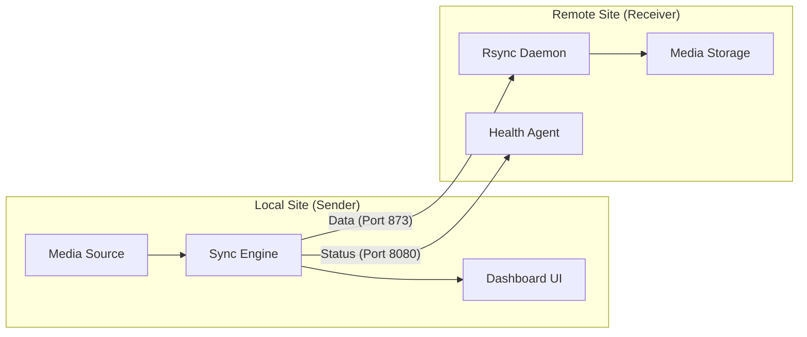

<div align="center">

# ⚡ Schnorarr

**The Ultra-Fast, Cyberpunk-Styled Sync Monitor**

[](https://goreportcard.com/report/github.com/arumes31/schnorarr)
[](https://opensource.org/licenses/MIT)
[](https://github.com/arumes31/schnorarr/pkgs/container/schnorarr)

</div>

**Schnorarr** is a high-performance, real-time file synchronization monitor and orchestrator designed for media servers. It visualizes file transfers, manages conflicts, and ensures your media libraries stay in perfect sync across multiple servers.

## 🚀 Features

*   **Real-Time Dashboard:** Live WebSocket-powered updates for transfer speeds, ETA, and file progress.
*   **Visual Transfer Graphs:** Beautiful Sparkline charts and "Node Map" visualizations.
*   **Multi-Engine Support:** Monitor and control multiple sync pairs (Sender -> Receiver) simultaneously.
*   **Smart Conflict Resolution:** Auto-detects and handles file conflicts with "Dry Run" previews.
*   **Cyberpunk Aesthetics:** Fully themed UI with 5 distinct color palettes (Cyber Green, Plasma Purple, Nuclear Orange, Crimson Red, Midnight Blue).
*   **Log Terminal:** Integrated web-based terminal for viewing real-time system logs with filtering.
*   **Discord Notifications:** Get alerted on sync completion or critical errors.
*   **Built-in Mesh VPN:** Optional Tailscale integration for secure, zero-config cross-network synchronization.

## 🛠️ Tech Stack

*   **Backend:** Go (Golang) 1.21+
*   **Database:** SQLite (embedded, zero-conf)
*   **Frontend:** HTML5, CSS3 (Variables), Vanilla JS (No heavy frameworks)
*   **Communication:** WebSockets (Gorilla)
*   **Deployment:** Docker / Docker Compose

## 📦 Installation

### Docker Compose (Recommended)

Schnorarr can run in two modes: **Sender** (the orchestrator that monitors files and pushes them) and **Receiver** (the destination agent).

#### Sender Configuration
The Sender monitors local directories and orchestrates the sync process to a Receiver.

```yaml
version: '3.8'
services:
  schnorarr-sender:
    image: ghcr.io/arumes31/schnorarr:latest
    container_name: schnorarr-sender
    ports:
      - "8080:8080"
    volumes:
      - ./config:/config
      - ./tailscale-state:/var/lib/tailscale
      - /mnt/media/movies:/source/movies
    environment:
      - MODE=sender
      - DEST_HOST=receiver-ip-or-hostname
      - DEST_MODULE=media
      - SYNC_1_SOURCE=/source/movies
      - SYNC_1_TARGET=media/movies
      - SYNC_1_RULE=series
      - BWLIMIT_MBPS=100
      - DISCORD_WEBHOOK_URL=https://discord.com/api/webhooks/...
      # - TAILSCALE_AUTHKEY=tskey-auth-xxxx
      # - TAILSCALE_UP_ARGS=--accept-routes
    restart: unless-stopped
```

#### Receiver Configuration
The Receiver acts as a passive target for the Sender.

```yaml
version: '3.8'
services:
  schnorarr-receiver:
    image: ghcr.io/arumes31/schnorarr:latest
    container_name: schnorarr-receiver
    ports:
      - "8080:8080"
    environment:
      - MODE=receiver
      # - TAILSCALE_AUTHKEY=tskey-auth-xxxx
      # - TAILSCALE_UP_ARGS=--accept-routes
    volumes:
      - /mnt/storage/media:/media
      - ./tailscale-state:/var/lib/tailscale
    restart: unless-stopped
```

## 🔄 Sync Capabilities & Rules

Schnorarr uses a **Smart Sync** strategy designed specifically for media libraries, minimizing the risk of accidental data loss.

### The "Smart Deletion" Logic
Regardless of the configured rule name (`series`, `flat`, etc.), the engine currently applies a unified safety logic:

1.  **Updates & Additions**: Files are transferred if they are new or if the source version is newer/different in size.
2.  **Protected Archives**: if a **top-level directory** exists on the Receiver but *not* on the Sender, it is treated as an "Archive" and **ignored**.
    *   *Example*: You delete `/source/movies/Matrix_Trilogy` locally to save space. Schnorarr sees `Matrix_Trilogy` on the receiver is unique and **will not delete it**.
3.  **Standard Deletions**: If a directory exists on *both* sides, but a file inside it is deleted from source, it **will be deleted** from the receiver.
    *   *Example*: You delete `movie.nfo` inside `/source/movies/Avatar/`. Since `/source/movies/Avatar/` still exists, `movie.nfo` is deleted from the receiver.
4.  **Directory Safety**: The sync engine currently **never deletes directories**, only files. This prevents recursive deletion accidents. Empty directories may remain on the receiver.

## ⚙️ Configuration (Environment Variables)

### General

| Variable | Description | Default |
| :--- | :--- | :--- |
| `MODE` | `sender` or `receiver` | `sender` |
| `PORT` | Web UI / API Port | `8080` |
| `PUID` / `PGID` | User/Group ID for file permissions | `1000` |
| `TAILSCALE_AUTHKEY` | Optional: Tailscale Auth Key for built-in mesh VPN | - |
| `TAILSCALE_UP_ARGS` | Optional: Extra arguments for `tailscale up` | - |

### Sender Specific

| Variable | Description | Example |
| :--- | :--- | :--- |
| `DEST_HOST` | Hostname or IP of the Receiver | `192.168.1.50` |
| `DEST_MODULE` | Rsync module name on Receiver | `media` |
| `BWLIMIT_MBPS` | Global bandwidth limit in Mbps | `50` |
| `SYNC_N_SOURCE` | Source path for engine `N` (1-10) | `/source/movies` |
| `SYNC_N_TARGET` | Target path for engine `N` (1-10) | `media/movies` |
| `SYNC_N_RULE` | Sync rule (`standard`, `series`, `flat`) | `series` |
| `DISCORD_WEBHOOK_URL` | Discord webhook for notifications | `https://...` |
| `TELEGRAM_BOT_TOKEN` | Telegram bot token | `123456:ABC...` |
| `TELEGRAM_CHAT_ID` | Telegram chat ID | `987654321` |

### Receiver Specific

| Variable | Description | Default |
| :--- | :--- | :--- |
| `RSYNC_CONFIG` | Custom path to rsyncd.conf | `/etc/rsyncd.conf` |

### Manual Build

```bash
git clone https://github.com/arumes31/schnorarr.git
cd schnorarr
go build -o schnorarr ./cmd/monitor
./schnorarr
```

## 🛣️ Path Mapping Guide

It is important to understand how Schnorarr constructs the final rsync destination path. The formula is:
`RECIEVER_IP / DEST_MODULE / SYNC_N_TARGET`

| Variable | Scope | Example Value | Resulting Path |
| :--- | :--- | :--- | :--- |
| `DEST_HOST` | Global | `192.168.1.50` | `192.168.1.50::...` |
| `DEST_MODULE` | Global | `media` | `192.168.1.50::media/...` |
| `SYNC_1_TARGET` | Engine 1 | `movies` | `192.168.1.50::media/movies` |
| `SYNC_2_TARGET` | Engine 2 | `series/anime` | `192.168.1.50::media/series/anime` |

> [!TIP]
> Ensure the `DEST_MODULE` exists in the Receiver's `rsyncd.conf` (usually mapped to a physical path like `/data`).

## 🔔 Notification Setup (Pro)

Schnorarr can send real-time alerts to Discord and Telegram. Here is how to get your credentials:

### Discord
1.  Open **Server Settings** -> **Integrations** -> **Webhooks**.
2.  Click **New Webhook**, select the target channel.
3.  Click **Copy Webhook URL** and paste it into `DISCORD_WEBHOOK_URL`.

### Telegram
1.  **Bot Token**: Message [@BotFather](https://t.me/botfather) and use `/newbot` to get your API Token.
2.  **Chat ID**: 
    - Message [@getIDbot](https://t.me/getidbot) to get your personal `Chat ID`.
    - Or, add your bot to a group and message [@myidbot](https://t.me/myidbot) inside the group.

## 🏗️ Architecture

Schnorarr operates as a distributed system with two specialized roles:

### 📤 Sender (Orchestrator)
- **Responsibility**: Monitors local directories, calculates diffs, and pushes data.
- **Components**: Go Sync Engine, SQLite Database, WebSocket Hub, Dashboard UI.
- **Port**: `8080` (Web UI/API).

### 📥 Receiver (Agent)
- **Responsibility**: Passive data target.
- **Components**: Rsync Daemon, Health Reporter.
- **Ports**: `873` (Rsync), `8080` (Health Check).



## 🔒 Security & Privacy

*   **Zero-Exposure**: Schnorarr does *not* require port forwarding. When used with the built-in **Tailscale** integration, your data stays within your private WireGuard® mesh.
*   **Encrypted Data**: All synchronization traffic over Tailscale is end-to-end encrypted.
*   **Authentication**: Supports `RSYNC_PASSWORD` for an extra layer of security between the sender and receiver.
*   **Minimal Footprint**: The binary is statically compiled with no external dependencies (except rsync).

## 💡 Best Practices

- **Read-Only Mounting**: Mount your source volumes as `:ro` on the **Sender** for peace of mind. Schnorarr never needs to write to the source.
- **Log Management**: Map `/config` to a persistent volume to preserve sync history and database across updates.
- **Memory Optimization**: For massive libraries (100k+ files), ensure your container has at least 512MB RAM for manifest hashing.

## 📊 Dashboard Guide

The Schnorarr dashboard is designed for high-density information display:

*   **Real-Time Status**: View total accumulated traffic and "Traffic Today" at a glance.
*   **Active Engines**: Each sync engine shows its current speed, percentage progress, ETA, and a 60-second speed sparkline.
*   **Node Map**: A real-time visualization of file transfer activity across all engines.
*   **Daily Traffic**: A 7-day bar chart showing data transfer volume trends.
*   **Top Files**: Rankings of the most frequently synced or largest files.
*   **Log Terminal**: A live-streaming terminal with ANSI color support and level filtering (INFO, WARN, ERROR).

## 🎛️ Advanced Configuration

Beyond the basic setup, you can fine-tune Schnorarr using these environment variables:

| Variable | Description | Default |
| :--- | :--- | :--- |
| `MIN_DISK_SPACE_GB` | (Sender) Stop syncing if source disk space falls below this. | `0` (Disabled) |
| `MAX_RETRIES` | (Sender) Number of attempts to connect to receiver before failing. | `30` |
| `CONFIG_DIR` | Path to store logs and cached manifests. | `/config` |
| `BWLIMIT_MBPS` | Global bandwidth limit for all transfers in Mbps. | `0` (Unlimited) |
| `RSYNC_PASSWORD` | Optional: Password for authenticated rsync transfers. | - |

### Sync Engine Tuning (Code Level)
Schnorarr is optimized for low CPU usage:
- **Scan Concurrency**: 8 parallel workers (reduced from 32).
- **Polling Interval**: Full "safety" scan runs every 60 seconds.
- **Full Refresh**: Massive reconciliation scan runs every 12 hours.

## 🔌 API Reference

Power users can interact with Schnorarr via its REST API:

| Endpoint | Method | Description |
| :--- | :--- | :--- |
| `/health` | `GET` | Returns JSON status of sender and receiver. |
| `/history` | `GET` | Returns the last 50 sync events. |
| `/api/engines/bulk` | `POST` | `{"action": "pause"\|"resume"}` - Controls all engines. |
| `/api/engine/:id/sync` | `POST` | Triggers immediate manual sync for engine `id`. |
| `/api/engine/:id/pause` | `POST` | Pauses a specific engine. |
| `/api/engine/:id/preview` | `GET` | Returns JSON list of files that *would* be synced (Dry Run). |

## 🛠️ Troubleshooting

*   **Receiver Offline**: Ensure `DEST_HOST` is reachable from the sender container and port `873` (rsync) and `8080` (health) are open.
*   **Permission Denied**: Check `PUID`/`PGID` settings. Ensure the container has write access to the mounted volumes.
*   **Stuck Sync**: Use the **"Reset Engine"** button in the dashboard to clear the local manifest cache and force a full re-scan.

## 🖼️ Screenshots

<div align="center">
  
</div>

## 📜 License

This project is licensed under the MIT License - see the [LICENSE](LICENSE) file for details.
