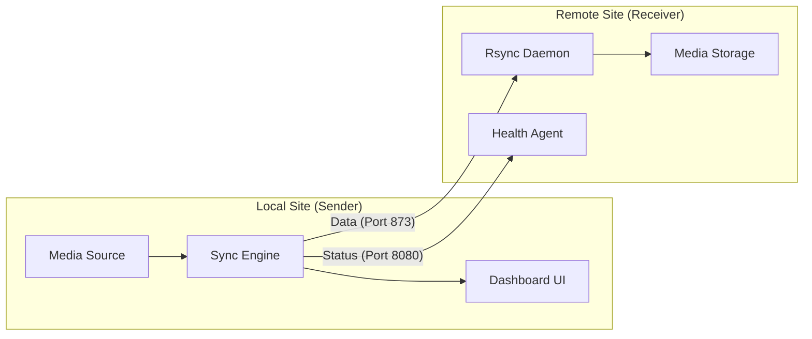

<div align="center">

# ⚡ Schnorarr

**The Ultra-Fast, Cyberpunk-Styled Sync Monitor**

[](https://goreportcard.com/report/github.com/arumes31/schnorarr)
[](https://opensource.org/licenses/MIT)
[](https://github.com/arumes31/schnorarr/pkgs/container/schnorarr)

</div>

**Schnorarr** is a high-performance, real-time file synchronization monitor and orchestrator designed for media servers. It visualizes file transfers, manages conflicts, and ensures your media libraries stay in perfect sync across multiple servers.

## 🚀 Features

*   **Real-Time Dashboard:** Live WebSocket-powered updates for transfer speeds, ETA, and file progress.
*   **Visual Transfer Graphs:** Per-engine speed history and global speed/latency charts.
*   **Multi-Engine Support:** Monitor and control multiple sync pairs (Sender -> Receiver) simultaneously.
*   **Smart Conflict Resolution:** Auto-detects and handles file conflicts with "Dry Run" previews.
*   **Cyberpunk Aesthetics:** Fully themed UI with 5 distinct color palettes (Cyber Green, Plasma Purple, Nuclear Orange, Crimson Red, Midnight Blue).
*   **Log Terminal:** Integrated web-based terminal for viewing real-time system logs with filtering.
*   **Discord Notifications:** Get alerted on sync completion or critical errors.
*   **Built-in Mesh VPN:** Optional Tailscale integration for secure, zero-config cross-network synchronization.

## Dashboard controls and accessibility

The dashboard puts engine status and actions before historical traffic. **Needs
attention** filters engines blocked by storage or awaiting review. A storage
failure includes the source/destination error, last check, and shared-token help.

The active mode and deletion/conflict policy appear beside global controls.
**Change policy** opens the settings section. Enabling automatic synchronization,
automatic deletion approval, or sender override requires a review of its scope.
Mode and conflict choices use segmented controls; deletion approval uses a switch.
An animated packet travels from source to destination during live transfers. It
pauses when updates are stale or the connection is offscreen; reduced-motion
users see a static highlighted arrow.
**Bandwidth & quiet hours** configures transfer limits; the live effective limit
also appears beside Speed. **Appearance** contains themes shared with History.

**Traffic history & charts** contains historical totals, speed/latency charts,
and largest transfers. **Log tools** contains scrolling, expansion, clear, and
download controls. **Sync help** explains archive semantics and storage checks.

The connection indicator distinguishes live updates from last-known data during
reconnection. A failed preview shows an error and retry control; execution stays
disabled until a current preview loads. Dialogs support keyboard navigation and
Escape. Global single-letter sync/pause shortcuts have been removed to prevent
accidental operations. Reduced-motion preferences suppress decorative movement.

Frontend regression checks use Node's built-in test runner:

```sh
node --test scripts/ui.test.cjs
go test ./...
```

## 🛠️ Tech Stack

*   **Backend:** Go (Golang) 1.21+
*   **Database:** SQLite (embedded, zero-conf)
*   **Frontend:** HTML5, CSS3 (Variables), Vanilla JS (No heavy frameworks)
*   **Communication:** WebSockets (Gorilla)
*   **Deployment:** Docker / Docker Compose

## 📦 Installation

### Docker Compose (Recommended)

Schnorarr can run in two modes: **Sender** (the orchestrator that monitors files and pushes them) and **Receiver** (the destination agent).

#### Sender Configuration
The Sender monitors local directories and orchestrates the sync process to a Receiver.

```yaml
version: '3.8'
services:
  schnorarr-sender:
    image: ghcr.io/arumes31/schnorarr:latest
    container_name: schnorarr-sender
    ports:
      - "8080:8080"
    volumes:
      - ./config:/config
      - ./tailscale-state:/var/lib/tailscale
      - /mnt/media/movies:/source/movies
    environment:
      - MODE=sender
      - DEST_HOST=receiver-ip-or-hostname
      - DEST_MODULE=media
      - SYNC_1_SOURCE=/source/movies
      - SYNC_1_TARGET=media/movies
      - SYNC_1_RULE=series
      - BWLIMIT_MBPS=100
      - DISCORD_WEBHOOK_URL=https://discord.com/api/webhooks/...
      # - TAILSCALE_AUTHKEY=tskey-auth-xxxx
      # - TAILSCALE_UP_ARGS=--accept-routes
    restart: unless-stopped
```

#### Receiver Configuration
The Receiver acts as a passive target for the Sender.

```yaml
version: '3.8'
services:
  schnorarr-receiver:
    image: ghcr.io/arumes31/schnorarr:latest
    container_name: schnorarr-receiver
    ports:
      - "8080:8080"
    environment:
      - MODE=receiver
      # - TAILSCALE_AUTHKEY=tskey-auth-xxxx
      # - TAILSCALE_UP_ARGS=--accept-routes
    volumes:
      - /mnt/storage/media:/media
      - ./tailscale-state:/var/lib/tailscale
    restart: unless-stopped
```

## 🔄 Sync Capabilities & Rules

### SMB / network share readiness

Each engine has a **Shared token** button. Its popup shows a persistent token,
the source and destination folders, and **Copy token** / **Download token file**
controls. No storage environment variables are required.

1. Open **Shared token** on the engine.
2. Download `.schnorarr-shared-token`, or create a plain text file with that
   exact name and paste only the displayed token into it. A trailing newline
   is allowed; do not add `.txt` to the filename.
3. Place the same file directly in this engine's **source folder** and
   **destination folder**, on their connected shares. For example, a movies
   engine needs the file inside each movies folder, not just the share root.

Schnorarr never creates these files on a share automatically: doing so could
make an unmounted local directory look valid. Both files must match the engine's
token. Token files and temporary probes are excluded from synchronization and
protected from deletion. Each independently mounted sync folder needs its file.

The dashboard remains available before setup. Engines show **STORAGE WAIT** and
wait for their token files at startup. Once an update is found, storage is
checked immediately before each new copy, after waiting for a transfer slot,
and before retries. Renames, deletions, and directory creation are guarded too.
The sender checks read access; the destination also performs a temporary
write/flush/remove probe. The receiver remembers verified folder/token pairs
in `/config/storage-tokens.json`, checks known folders at startup, and uses
those expected tokens to independently guard each rsync transfer.

Failed checks stop the current plan. Pending work retries on the existing
`POLL_INTERVAL` and rescans after recovery; storage failures do not enter the
one-hour per-file retry delay. Failed destination scans abort both previews
and syncs instead of pretending the destination is empty.

There is **no Docker healthcheck or idle storage probe**. `/health` remains
a liveness endpoint. `/api/storage-ready` verifies a specific folder on demand;
the sender sends the expected token in a header. The rsync hook uses
`monitor --check-storage` to check its transfer path without opening the database.
A probe has a five-second caller deadline; an SMB kernel call
may take longer to unwind, and the process permits only one outstanding probe.
These checks gate new work, not a transfer already in progress, and cannot
make the check and subsequent filesystem operation atomic. A sender marker
read can also be served from the SMB client's cache.

Tokens survive restarts in the sender's `/config/history.db`. Keep the config
volume; replacing it generates new tokens and requires updating the folder
files. Both sender and receiver must run the updated version.

This replaces `.schnorarr-share-id` and the previous `STORAGE_N_PATH` /
`STORAGE_N_ID` variables. Old markers no longer satisfy readiness checks; use
the token from the engine popup in the new filename instead.

Schnorarr uses a **Smart Sync** strategy designed specifically for media libraries, minimizing the risk of accidental data loss.

### The "Smart Deletion" Logic
Regardless of the configured rule name (`series`, `flat`, etc.), the engine currently applies a unified safety logic:

1.  **Updates & Additions**: Files are transferred if they are new or if the source version is newer/different in size.
2.  **Protected Archives**: if a **top-level directory** exists on the Receiver but *not* on the Sender, it is treated as an "Archive" and **ignored**.
    *   *Example*: You delete `/source/movies/Matrix_Trilogy` locally to save space. Schnorarr sees `Matrix_Trilogy` on the receiver is unique and **will not delete it**.
3.  **Standard Deletions**: If a directory exists on *both* sides, but a file inside it is deleted from source, it **will be deleted** from the receiver.
    *   *Example*: You delete `movie.nfo` inside `/source/movies/Avatar/`. Since `/source/movies/Avatar/` still exists, `movie.nfo` is deleted from the receiver.
4.  **Directory Safety**: The sync engine currently **never deletes directories**, only files. This prevents recursive deletion accidents. Empty directories may remain on the receiver.

## ⚙️ Configuration (Environment Variables)

### General

| Variable | Description | Default |
| :--- | :--- | :--- |
| `MODE` | `sender` or `receiver` | `sender` |
| `PORT` | Web UI / API Port | `8080` |
| `PUID` / `PGID` | User/Group ID for file permissions | `1000` |
| `TAILSCALE_AUTHKEY` | Optional: Tailscale Auth Key for built-in mesh VPN | - |
| `TAILSCALE_UP_ARGS` | Optional: Extra arguments for `tailscale up` | - |

### Sender Specific

| Variable | Description | Example |
| :--- | :--- | :--- |
| `DEST_HOST` | Hostname or IP of the Receiver | `192.168.1.50` |
| `DEST_MODULE` | Rsync module name on Receiver | `media` |
| `BWLIMIT_MBPS` | Initial global bandwidth limit in Mbps (fallback; the value saved from the dashboard's Traffic Shaping card takes precedence) | `50` |
| `SYNC_N_SOURCE` | Source path for engine `N` (1-10) | `/source/movies` |
| `SYNC_N_TARGET` | Target path for engine `N` (1-10) | `media/movies` |
| `SYNC_N_RULE` | Sync rule (`standard`, `series`, `flat`) | `series` |
| `SYNC_INCLUDE` | Global file filter (default: `*.mkv,*.mp4,*.avi`) | `*.mkv,*.mp4` |
| `SYNC_N_INCLUDE` | Per-engine file filter override (N=1-10) | `*.txt` |
| `DISCORD_WEBHOOK_URL` | Discord webhook for notifications | `https://...` |
| `TELEGRAM_BOT_TOKEN` | Telegram bot token | `123456:ABC...` |
| `TELEGRAM_CHAT_ID` | Telegram chat ID | `987654321` |

### Receiver Specific

| Variable | Description | Default |
| :--- | :--- | :--- |
| `RSYNC_CONFIG` | Custom path to rsyncd.conf | `/etc/rsyncd.conf` |

### Manual Build

```bash
git clone https://github.com/arumes31/schnorarr.git
cd schnorarr
go build -o schnorarr ./cmd/monitor
./schnorarr
```

## 🛣️ Path Mapping Guide

It is important to understand how Schnorarr constructs the final rsync destination path. The formula is:
`RECIEVER_IP / DEST_MODULE / SYNC_N_TARGET`

| Variable | Scope | Example Value | Resulting Path |
| :--- | :--- | :--- | :--- |
| `DEST_HOST` | Global | `192.168.1.50` | `192.168.1.50::...` |
| `DEST_MODULE` | Global | `media` | `192.168.1.50::media/...` |
| `SYNC_1_TARGET` | Engine 1 | `movies` | `192.168.1.50::media/movies` |
| `SYNC_2_TARGET` | Engine 2 | `series/anime` | `192.168.1.50::media/series/anime` |

> [!TIP]
> Ensure the `DEST_MODULE` exists in the Receiver's `rsyncd.conf` (usually mapped to a physical path like `/data`).

## 🔔 Notification Setup (Pro)

Schnorarr can send real-time alerts to Discord and Telegram. Here is how to get your credentials:

### Discord
1.  Open **Server Settings** -> **Integrations** -> **Webhooks**.
2.  Click **New Webhook**, select the target channel.
3.  Click **Copy Webhook URL** and paste it into `DISCORD_WEBHOOK_URL`.

### Telegram
1.  **Bot Token**: Message [@BotFather](https://t.me/botfather) and use `/newbot` to get your API Token.
2.  **Chat ID**: 
    - Message [@getIDbot](https://t.me/getidbot) to get your personal `Chat ID`.
    - Or, add your bot to a group and message [@myidbot](https://t.me/myidbot) inside the group.

## 🏗️ Architecture

Schnorarr operates as a distributed system with two specialized roles:

### 📤 Sender (Orchestrator)
- **Responsibility**: Monitors local directories, calculates diffs, and pushes data.
- **Components**: Go Sync Engine, SQLite Database, WebSocket Hub, Dashboard UI.
- **Port**: `8080` (Web UI/API).

### 📥 Receiver (Agent)
- **Responsibility**: Passive data target.
- **Components**: Rsync Daemon, Health Reporter.
- **Ports**: `873` (Rsync), `8080` (Health Check).


```mermaid
graph LR
    subgraph "Local Site (Sender)"
        A[Media Source] --> B[Sync Engine]
        B --> C[Dashboard UI]
    end
    subgraph "Remote Site (Receiver)"
        D[Rsync Daemon] --> E[Media Storage]
        F[Health Agent]
    end
    B -- "Data (Port 873)" --> D
    B -- "Status (Port 8080)" --> F
```

## 🔒 Security & Privacy

*   **Zero-Exposure**: Schnorarr does *not* require port forwarding. When used with the built-in **Tailscale** integration, your data stays within your private WireGuard® mesh.
*   **Encrypted Data**: All synchronization traffic over Tailscale is end-to-end encrypted.
*   **Authentication**: Supports `RSYNC_PASSWORD` for an extra layer of security between the sender and receiver.
*   **Minimal Footprint**: The binary is statically compiled with no external dependencies (except rsync).

## 💡 Best Practices

- **Read-Only Mounting**: Mount your source volumes as `:ro` on the **Sender** for peace of mind. Schnorarr never needs to write to the source.
- **Log Management**: Map `/config` to a persistent volume to preserve sync history and database across updates.
- **Memory Optimization**: For massive libraries (100k+ files), ensure your container has at least 512MB RAM for manifest hashing.

## 📊 Dashboard Guide

The dashboard prioritizes operational decisions:

*   **Engine status**: Storage-blocked and active engines appear first on load. The attention filter follows live state without moving focused controls.
*   **Current transfers**: Per-engine progress, speed, elapsed time, and speed history, with global speed and effective bandwidth limits above.
*   **Engine details**: Per-engine traffic totals, reliability grade, layout rule, and shared-token instructions.
*   **Traffic history & charts**: Today/all-time totals, speed and receiver-latency charts, and largest transfers in the last 24 hours.
*   **Live logs**: Search and level filtering, with named utility controls under Log tools.

## 🎛️ Advanced Configuration

Beyond the basic setup, you can fine-tune Schnorarr using these environment variables:

| Variable | Description | Default |
| :--- | :--- | :--- |
| `MIN_DISK_SPACE_GB` | (Sender) Stop syncing if source disk space falls below this. | `0` (Disabled) |
| `MAX_RETRIES` | (Sender) Number of attempts to connect to receiver before failing. | `30` |
| `CONFIG_DIR` | Path to store logs and database. | `/config` |
| `BWLIMIT_MBPS` | Initial global bandwidth limit for all transfers in Mbps. Shared across active engines and adjustable at runtime from Bandwidth & quiet hours; the saved dashboard value wins over this env var. | `0` (Unlimited) |
| `RSYNC_PASSWORD` | Optional: Password for authenticated rsync transfers. | - |
| `POLL_INTERVAL` | (Sender) Frequency in seconds to check for file changes. | `60` |
| `WATCH_INTERVAL` | (Sender) Frequency in seconds for a full safety reconciliation scan. | `43200` (12h) |

### Sync Engine Tuning
Schnorarr is optimized for low CPU usage:
- **Scan Concurrency**: 8 parallel workers.
- **Polling Interval**: Full "safety" scan runs every `POLL_INTERVAL` seconds (default: 60s).
- **Full Refresh**: Massive reconciliation scan runs every `WATCH_INTERVAL` seconds (default: 12h).

## 🔌 API Reference

Power users can interact with Schnorarr via its REST API:

| Endpoint | Method | Description |
| :--- | :--- | :--- |
| `/health` | `GET` | Returns JSON status of sender and receiver. |
| `/history` | `GET` | Returns the last 50 sync events. |
| `/api/engines/bulk` | `POST` | `{"action": "pause"\|"resume"}` - Controls all engines. |
| `/api/engine/:id/sync` | `POST` | Triggers immediate manual sync for engine `id`. |
| `/api/engine/:id/pause` | `POST` | Pauses a specific engine. |
| `/api/engine/:id/preview` | `GET` | Returns JSON list of files that *would* be synced (Dry Run). |

## 🛠️ Troubleshooting

*   **Receiver Offline**: Ensure `DEST_HOST` is reachable from the sender container and port `873` (rsync) and `8080` (health) are open.
*   **Permission Denied**: Check `PUID`/`PGID` settings. Ensure the container has write access to the mounted volumes.
*   **Stuck Sync**: Use the **"Reset Engine"** button in the dashboard to force a full re-scan.

## 🖼️ Screenshots

<div align="center">
  
</div>

## 📜 License

This project is licensed under the MIT License - see the [LICENSE](LICENSE) file for details.
